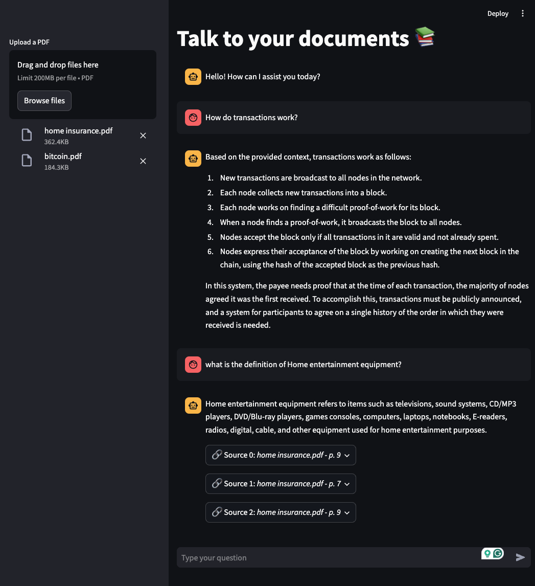

# Documentation: Talk to Your Documents 📚

## Overview
This application allows users to interact with PDF documents through a conversational interface. Users can upload PDF files, and the system processes them to extract meaningful information. By leveraging advanced language models and vector-based retrieval techniques, the app enables intelligent question-answering based on the uploaded documents.

---

## Features
- Upload and process PDF documents.
- Use various language models (“HuggingFace Hub”, “OpenAI”, or “Ollama”).
- Split documents into smaller chunks for efficient processing.
- Use embeddings and FAISS for document retrieval.
- Context-aware question reformulation for improved responses.
- Chat interface for seamless interaction.

---

## Code Breakdown

### 1. **Page Setup**
```python
st.set_page_config(
  page_title="Talk to your documents 📚",
  page_icon="📚",
)
st.title("Talk to your documents 📚")
```
Sets the Streamlit page title and icon for a clean user interface.

### 2. **Model Configuration**
#### HuggingFace Hub
```python
def model_hf_hub(model="meta-llama/Meta-Llama-3-8B-Instruct", temperature=0.1):
    llm = HuggingFaceEndpoint(
        repo_id=model,
        temperature=temperature, 
        max_new_tokens=512,
        return_full_text=False,
        stop=["<|eot_id|>"],
    )
    return llm
```
Loads a language model from HuggingFace Hub.

#### OpenAI
```python
def model_openai(model="gpt-4o-mini", temperature=0.1):
    openai_api_key = os.getenv("OPENAI_API_KEY")
    os.environ["OPENAI_API_KEY"] = openai_api_key

    llm = ChatOpenAI(
        model_name=model,
        temperature=temperature,
    )
    return llm
```
Loads an OpenAI model using the API key.

#### Ollama
```python
def model_ollama(model="phi3", temperature=0.1):
    llm = ChatOllama(model=model, temperature=temperature)
    return llm
```
Loads an Ollama model.

### 3. **Retriever Configuration**
```python
def config_retriever(uploads):
    docs = []
    temp_dir = tempfile.TemporaryDirectory()

    for file in uploads:
        temp_file_path = os.path.join(temp_dir.name, file.name)
        with open(temp_file_path, "wb") as f:
            f.write(file.getvalue())
        loader = PyPDFLoader(temp_file_path)
        docs.extend(loader.load())

    text_splitter = RecursiveCharacterTextSplitter(
        chunk_size=1000,
        chunk_overlap=200,
    )
    splits = text_splitter.split_documents(docs)

    embeddings = HuggingFaceEmbeddings(model_name="BAAI/bge-m3")

    vectorstore = FAISS.from_documents(splits, embeddings)
    vectorstore.save_local('vectorestore/db_faiss')

    retriever = vectorstore.as_retriever(
        search_type="mmr",
        search_kwargs={"k": 3, "fetch_k": 4},
    )

    return retriever
```
Processes uploaded PDFs, splits the text into chunks, creates embeddings, and stores them in a FAISS index for efficient retrieval.

### 4. **RAG Chain Configuration**
```python
def config_rag_chain(model_class, retriever):
    if model_class == "hf_hub":
        llm = model_hf_hub()
    elif model_class == "openai":
        llm = model_openai()
    elif model_class == "ollama":
        llm = model_ollama()

    token_s, token_e = ("", "") if not model_class.startswith("hf") else ("<|begin_of_text|><|start_header_id|>system<|end_header_id|>", "<|eot_id|><|start_header_id|>assistant<|end_header_id|>")

    context_q_prompt = ChatPromptTemplate.from_messages([
        ("system", token_s + "..."),
        MessagesPlaceholder("chat_history"),
        ("human", "Question: {input}" + token_e),
    ])

    history_aware_retriever = create_history_aware_retriever(
        llm,
        retriever,
        prompt=context_q_prompt
    )

    qa_prompt = PromptTemplate.from_template(token_s + "..." + token_e)

    qa_chain = create_stuff_documents_chain(
        llm,
        qa_prompt
    )

    rag_chain = create_retrieval_chain(
        history_aware_retriever,
        qa_chain
    )

    return rag_chain
```
Configures a Retrieval-Augmented Generation (RAG) chain for intelligent question-answering.

### 5. **User Interaction**
Handles file uploads, maintains chat history, and processes user queries.
```python
uploads = st.sidebar.file_uploader(
    label="Upload a PDF",
    type=["pdf"],
    accept_multiple_files=True,
)

if not uploads:
    st.write("Please upload a PDF file to start the conversation.")
    st.stop()

if "chat_history" not in st.session_state:
    st.session_state.chat_history = [AIMessage(content="Hello! How can I assist you today?")]

user_query = st.chat_input("Type your question")

if user_query and uploads:
    ...
```

---

## Libraries Used
- **[Streamlit](https://streamlit.io/):** Web application framework.
- **[FAISS](https://github.com/facebookresearch/faiss):** Efficient similarity search.
- **[LangChain](https://www.langchain.com/):** Framework for building LLM applications.
- **[PyPDFLoader](https://pypi.org/project/pypdf/):** For PDF document loading.
- **[HuggingFace](https://huggingface.co/):** NLP models and embeddings.
- **[OpenAI](https://openai.com/):** GPT-based language models.

---

## Output
- **Chat Interface:** Users can upload PDFs and ask questions.
- **Contextual Responses:** System retrieves relevant document sections and provides concise answers.
- **Source References:** Displays document sources and pages for transparency.
- **Examples:**
  - When asked "How do transactions work?", the LLM understood the context from a Bitcoin-related PDF without explicitly mentioning the file.
  - When asked "Home entertainment equipment?", the system retrieved relevant details from a home insurance PDF.



---

## Usage Instructions
1. **Install Dependencies:**
   ```bash
   pip install streamlit faiss-cpu langchain-core langchain-ollama langchain-openai langchain-huggingface
   ```
2. **Run the Application:**
   ```bash
   streamlit run index.py
   ```
3. **Upload PDFs:** Use the sidebar to upload one or more PDF documents.
4. **Interact:** Type your questions in the chat interface and receive responses with source references.